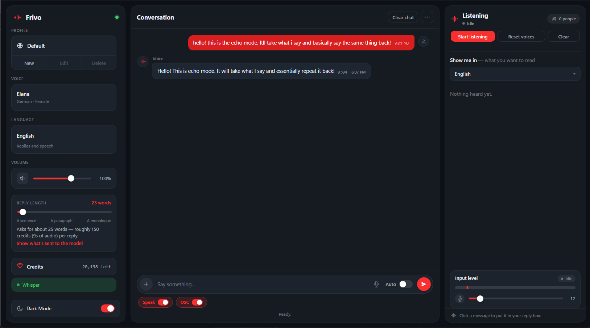
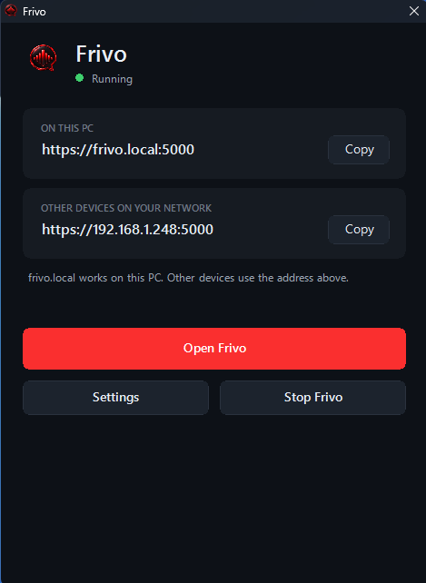
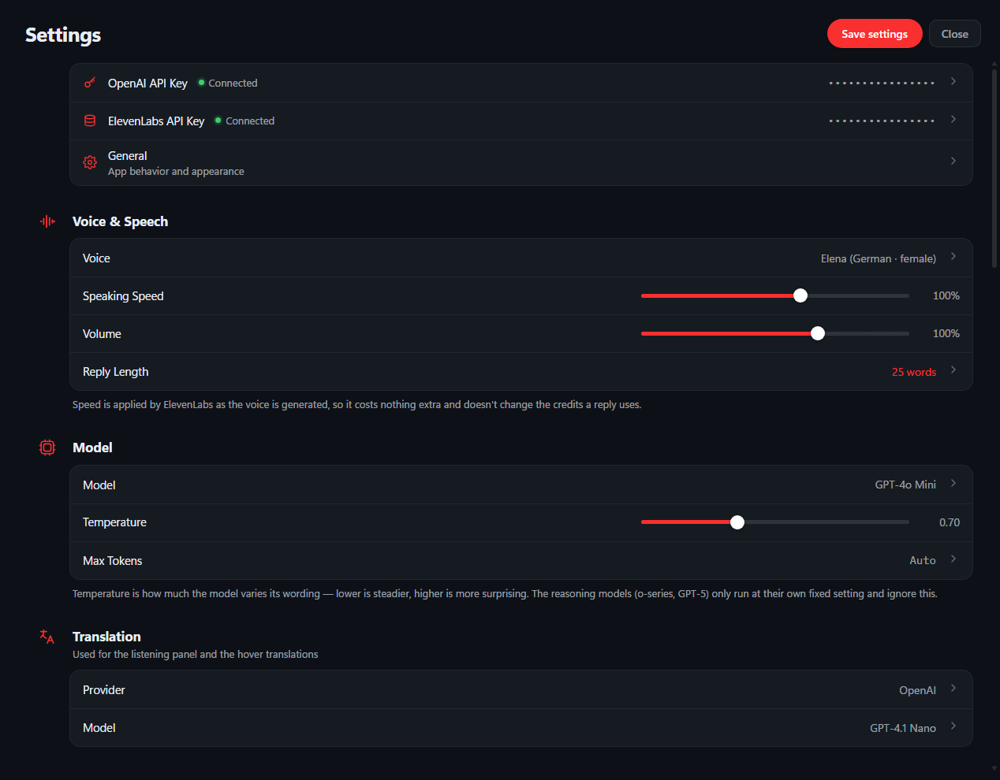
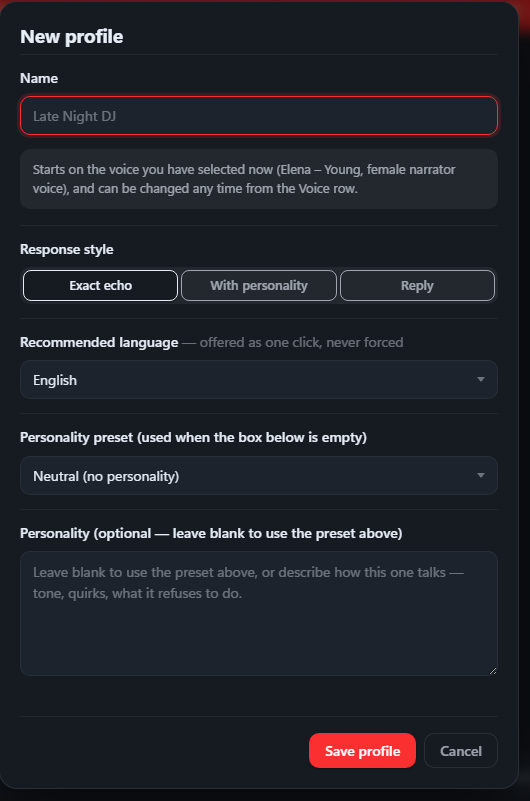

# Frivo

Frivo is a local Windows dashboard for conversational AI, voice output,
profiles, and VRChat chatbox messages over OSC. It runs on your computer and
opens in your web browser.

## Screenshots

### Dashboard

### Launcher

### Settings

### New profile

## Download and install

1. Download `FrivoSetup.exe` from the latest GitHub release.
2. Double-click it and approve the Windows permission prompt.
3. Follow the Frivo setup screens. The default installation location is
   recommended.
4. When setup finishes, leave **Launch Frivo now** selected to open Frivo.

The first setup may download Python and Frivo's required libraries, so an
internet connection is needed while installing. Frivo is supported on
Windows 10 and Windows 11.

## First-time setup

Open Frivo from the desktop or Start Menu shortcut, then select **Open
Frivo** in the small Frivo window. In the dashboard, open **Settings** and
save your API keys.

* **OpenAI API key** — required for the default chat experience.
* **ElevenLabs API key** — required only when **Speak** is enabled.

If you do not have an ElevenLabs key, turn **Speak** off. Frivo can still
return text replies with an OpenAI key. If Speak is on without an ElevenLabs
key, Frivo shows a helpful error and does not send the message.

API providers may charge for their services. You are responsible for your
own OpenAI and ElevenLabs accounts, usage, and costs.

## Local Ollama models

If you prefer not to use OpenAI for chat and translation, Frivo can use a
locally hosted Ollama model instead. Install and run Ollama, then select
**Ollama (local)** in **Settings** > **Providers** and choose your model.
An OpenAI API key is not required when chat and translation use Ollama.

For dictation and listening, Frivo can also use **Local Whisper** to
transcribe audio on your computer or local network. Whisper transcribes the
audio; Frivo then translates the resulting text with the translation provider
you selected, such as Ollama or OpenAI.

## Recommended audio routing: Voicemeeter

Frivo works without Voicemeeter, but Voicemeeter and its virtual audio cables
are recommended when using Frivo's listening features or sending Frivo's
spoken replies into VRChat.

Use a dedicated virtual cable for the program or game you want Frivo to
listen to, then select that cable as Frivo's listening input. This lets
Frivo hear that source without also capturing your microphone, other apps,
or the rest of your system audio.

For VRChat voice output, route Frivo's spoken audio to the virtual output you
use for VRChat, then select the matching virtual input as VRChat's microphone.
The exact device names depend on your Voicemeeter setup. Frivo does not
install or configure Voicemeeter for you.

## Everyday use

The Frivo window starts and monitors the local server. It shows the address
for this computer and provides these controls:

* **Open Frivo** opens the dashboard in your browser.
* **Settings** controls whether Frivo stays running after the window closes,
  starts with Windows, and opens automatically in your browser.
* **Stop Frivo** stops the local server.

The desktop and Start Menu shortcuts open the Frivo window. If Frivo is
already running in the notification area, using a shortcut brings that window
back.

On the same computer, the dashboard is normally available at:

    https://frivo.local:5000

## VRChat OSC chatbox

Frivo can send replies to the VRChat chatbox through OSC. It does not control
your avatar or send messages until you enable it.

1. In VRChat, enable and configure OSC in the Options menu.
2. In Frivo, open **Settings** > **VRChat chatbox**.
3. Enter the LAN address of the PC running VRChat. Use `127.0.0.1` when
   VRChat and Frivo run on the same PC.
4. Leave the default port as `9000` unless your VRChat OSC configuration uses
   another port, then use **Test**.
5. Turn on the **OSC** switch beside the message box when you want replies
   sent to the chatbox.

VRChat chatbox messages are limited to 144 characters. Frivo automatically
pages longer messages and spaces them out to avoid VRChat's spam protection.
Anyone who can see your VRChat chatbox may see these messages. OSC uses UDP,
so delivery cannot be confirmed by Frivo.

If VRChat runs on another PC, that PC must allow inbound UDP traffic on the
chosen OSC port (normally UDP 9000).

## Other devices on your network

During setup, you can allow connections from other devices on your private
network. The Frivo window then shows a network address such as:

    https://192.168.x.x:5000

Only enable this on a network you trust. A phone or another computer may show
a certificate warning on its first visit because Frivo's local certificate is
trusted only on the PC where Frivo was installed.

If you skipped this option during setup, use the Frivo launcher Settings to
open the firewall port later.

## Privacy and saved data

Frivo keeps its data on your PC in:

    %APPDATA%\Frivo\

This includes your settings, saved profiles, local usage record, generated
audio cache, and API keys. API keys are stored in `config.json` in plain text
for the signed-in Windows account. Do not share that file or upload it to
GitHub.

This repository intentionally excludes keys, preferences, logs, certificates,
and generated audio.

## Uninstalling

Open **Settings** > **Apps** > **Installed apps**, choose **Frivo**, and
select **Uninstall**.

The uninstaller removes Frivo, its shortcuts, its Windows startup entry, the
Frivo firewall rule, its local address and certificate. It asks whether to
also remove Frivo's saved API keys and preferences. Leave that option
unchecked if you plan to reinstall later.

## Troubleshooting

If installation fails, the setup log is saved here:

    %TEMP%\Frivo-Setup.log

The Frivo launcher also includes buttons to open its server log and settings
folder.

## Building from source

For development, clone this repository and run `Install.bat` to use the
source setup wizard. To create the public single-file installer, run:

    powershell -ExecutionPolicy Bypass -File build\Build-Installer.ps1

The finished installer is written to `dist\FrivoSetup.exe`.
